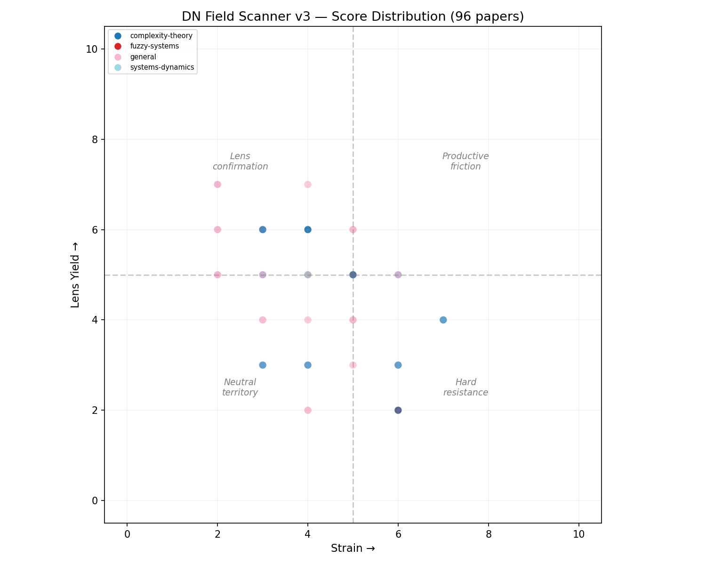

# DN Field Scanner

An autonomous research system that tests whether the DN Framework's dimensional architecture functions as a useful **lens** for interpreting academic findings — not whether external research "confirms" or "denies" the framework.

## What Changed (v2 → v3)

The original charter (preserved in [`original-charter/`](original-charter/)) ran 15 cycles across 50 papers. Every paper landed in the bottom two quadrants: 66% Neutral Territory, 34% Hard Resistance, 0% in either top quadrant. The validation ceiling was 3/10.

**Diagnosis:** The scoring system was designed to test DN as a *theory* — asking whether papers independently arrive at DN's structural claims. But DN positions itself as a *meta-framework*: a dimensional lens for decomposing how intelligence organizes, not a competing hypothesis. The validation rubric was asking the wrong question, and the paper selection was pulling in too many low-relevance domains that predictably landed in Neutral Territory.

**What v3 changes:**

1. **Replaces "Validation" with "Lens Yield"** — measures whether applying DN's architecture to a paper's findings produces structural insight the paper itself doesn't articulate. This directly tests the meta-positional claim.
2. **Adds "Independent Confirmation" as a secondary signal** — the old validation question (did the paper independently arrive at DN-like structures?) is preserved but no longer dominates the scoring.
3. **Tightens paper selection** — targets papers dealing with dimensional/hierarchical organization, multi-force dynamics, phase transitions, and integration-vs-decomposition debates. Reduces noise from developmental/educational studies where any stage-theory maps loosely.
4. **Reframes the Interpretation Charter** — the core question shifts from "Does this paper confirm or deny DN?" to "What does this paper look like through DN's dimensional architecture, and does that view add explanatory value?"

## What This Is

DN Field Scanner is a self-running system. Every day, it:

1. Fetches recent papers from across disciplines — complexity theory, network science, cognitive science, decision science, systems dynamics, organizational behavior, consciousness studies, and adjacent fields
2. Selects papers — 1 most likely to *strain* the framework, 1 most likely to yield *lens insight*, 1 from a *high-dimensional domain* (targeting 6D–9D engagement and Heart pillar coverage)
3. Interprets those papers through the DN Framework's dimensional architecture, testing whether the lens adds structural clarity beyond the paper's native framing
4. Updates its living model of the framework's cross-disciplinary standing based on what it finds
5. Tracks unresolved tensions — places where the framework fails, strains, or produces surprising structural descriptions

The system commits its outputs to this repository. **The git history is the Field Ledger** — each commit is a resolution event, an irreversible state update to the framework's developmental record.

## What To Read

- **[state/model.md](state/model.md)** — The system's current model of the DN Framework's cross-disciplinary standing. This is a living document that evolves with each cycle.
- **[tensions/open.md](tensions/open.md)** — Unresolved states. Things the framework cannot yet account for, or places where external research formalizes something DN claims but with greater rigor.
- **[tensions/ledger.md](tensions/ledger.md)** — Structured tension ledger with citation tracking and review queue. **Check this periodically** — when a tension reaches 3+ citations, that's the signal to open the Kernel.
- **[cycles/](cycles/)** — One file per cycle. Each contains the full interpretive output.
- **[original-charter/](original-charter/)** — The complete v2 dataset: 50 papers, 15 cycles, all scores, tensions, and state from the original charter. Preserved for reference.

## What This Is Not

This system is not trying to prove the DN Framework correct. It is testing whether the framework functions as a useful structural lens across domains. Comfortable coherence is failure. Productive tension is success. The interesting outputs are:

- **Lens yield**: Places where applying DN's architecture reveals structural relationships a paper's own framing missed
- **Hard resistance**: Places where the framework genuinely cannot account for a finding
- **Formal exceeding**: Places where external research formalizes something DN handles only narratively

## The DN Framework in Brief

The DN Framework is a domain-universal architecture for how intelligence organizes itself. Its formal specification layer, the **DN Kernel**, defines structural invariants. The core claims this system is testing:

- **Dimensional Progression (1D–9D):** Intelligence follows a natural structural progression from Spark (1D) through Reaction (2D), Context (3D), Temporal (4D), Singularity (5D), Connection (6D), Manifestation (7D), Recursion (8D), to Frontier (9D). This is a map of structure, not a sequential climbing mandate.
- **Pillar Metric:** Heart (motivational force), Truth (structural integrity), and Nuance (contextual sensitivity) are universal governing metrics for intelligence in any domain.
- **Five Forces:** Gravity, Resonance, Transmutation, Entropy, and Shadow describe the complete dynamics of intelligence fields. These are dynamics, not mechanisms.
- **Flow as Transport:** Intelligence propagates through connective tissue with finite capacity, variable fidelity, and activation conditions.
- **Domain Universality:** The dimensional architecture does not change across domains. The meta-positional claim is that DN provides a structural grammar for decomposing *any* framework's findings into dimensional terms.

The full specification is maintained in the [DN Kernel](https://github.com/DeusNosMachina/DN_Framework) and the [DN Glossary](https://dnframework.ai).

## How It Runs

The system runs daily at 06:00 UTC via GitHub Actions. It can also be triggered manually from the Actions tab. The interpretive engine is Claude (claude-opus-4-6), called via the Anthropic API with a system prompt that includes the DN Kernel specification, Glossary, and Interpretation Charter as grounding context.

## Architecture

```
agent/run.py              — The main agent script (fetch, select, interpret, score, update)
agent/prompts/             — Interpretation prompts and charter
  interpretation_charter.md — HOW to think through DN as a lens (v3.0)
state/model.md             — Living document: the framework's cross-disciplinary standing
tensions/open.md           — Unresolved tensions (raw append log)
tensions/ledger.md         — Structured tension ledger with citation tracking and review queue
tensions/gardn-candidates.md — GarDN implementation candidates (findings → product)
cycles/YYYY-MM-DD.md       — Per-cycle output files
scoring/scores.jsonl       — Accumulated scores (one JSON object per paper)
scoring/distribution.png   — Auto-generated scatter plot (regenerated every cycle)
original-charter/          — Complete v2 dataset (50 papers, 15 cycles) preserved for reference
.github/workflows/         — GitHub Actions scheduling
```

### Context Loading Order

Each interpretation cycle loads context in this order:

1. **DN Kernel** — The formal specification (structural invariants, axioms, objects)
2. **DN Glossary** — The vocabulary reference (dimensional definitions, pillar breakdowns)
3. **Interpretation Charter** — HOW to think through the framework as a lens. This is the most important document for interpretation quality.
4. **Current state** — `state/model.md` and `tensions/open.md` for continuity across cycles

## Paper Selection Strategy

v3 changes the selection ratio from 2-strain/1-validation to a balanced 1-1-1 approach:

**Strain candidate (1 per cycle):** The paper most likely to challenge the framework. Priority signals:
- Research that formalizes something DN handles informally (formal exceeding)
- Findings that suggest intelligence does *not* follow dimensional organization
- Evidence of successful frameworks using fundamentally different structural primitives
- Cross-disciplinary work achieving integration without anything resembling pillars, dimensions, or fields

**Lens candidate (1 per cycle):** The paper most likely to yield structural insight when viewed through DN's architecture. Priority signals:
- Research on multi-phase or multi-stage phenomena where dimensional mapping should add explanatory value
- Papers dealing with hierarchical organization, emergence, or phase transitions
- Findings where the paper's own framing is incomplete and DN's lens might reveal unnoticed structure
- Studies where Heart/Truth/Nuance decomposition could illuminate what the paper treats as a single dimension

**High-dimensional candidate (1 per cycle):** The paper most likely to engage underserved framework territory. Priority signals:
- Research engaging with Connection (6D), Manifestation (7D), Recursion (8D), or Frontier (9D)
- Papers where Heart pillar leads (meaning, purpose, motivation as primary analytical axis)
- Shadow engagement: absence, hesitancy, structural inversions, productive disconnection
- Papers from domains where DN's unique contributions (shadow symmetry, five forces, pillar triad) have the most traction

**Source domains** (tightened from v2):
- Complexity theory and network science
- Cognitive and developmental psychology
- Decision science and fuzzy systems (MCDM, IFS)
- Consciousness studies and phenomenology
- Systems dynamics and organizational behavior
- Creativity and innovation research
- Philosophy of mind and philosophy of science

## Scoring

After each interpretive cycle, every paper is scored on two axes (0–10 each):

### Axis 1: Strain (unchanged from v2)

How much the paper resists interpretation through the DN Framework.
- 0 = trivially handled
- 5 = real tension exists
- 10 = the framework cannot coherently account for the finding

**Strain threshold rule:** Scores above 5 require identification of a specific DN claim the paper contradicts or exceeds. Vague discomfort is not strain — the scorer must name the Kernel section, axiom, or invariant that is challenged.

### Axis 2: Lens Yield (replaces Validation)

How much structural insight DN's architecture produces when applied to this paper's findings — insight the paper itself does not articulate.
- 0 = DN adds nothing; the paper's native framing is already complete
- 3 = DN can narrate the findings but adds no new structural clarity (the "describing DN back to itself" trap)
- 5 = DN's lens reveals a structural relationship or pattern the paper doesn't name
- 7 = DN's architecture reorganizes the paper's findings in a way that produces genuinely new insight
- 10 = DN's lens predicts or illuminates structural properties the paper's methodology missed entirely

**Lens Yield threshold rule:** Scores above 3 require the scorer to articulate WHAT structural insight DN's lens produced that the paper's own framing did not. "DN can describe this" is not lens yield — the scorer must state what DN *revealed*. Scores above 5 require identifying the specific DN architectural element (dimension, pillar, force, shadow structure) that produced the insight.

**Independent Confirmation bonus:** If the paper also independently arrives at a structural principle DN specifically claims (the old validation criterion), this is noted as a separate field in the scoring schema. It does not replace Lens Yield but supplements it.

### Scoring Schema

```json
{
  "date": "2026-04-01",
  "paper": {
    "title": "Paper title",
    "authors": ["Author1", "Author2"],
    "source": "journal/arxiv",
    "url": "https://...",
    "domain": "complexity-theory"
  },
  "strain": 3,
  "lens_yield": 5,
  "strain_rationale": "What specific DN claim is challenged and how",
  "lens_yield_rationale": "What structural insight DN's lens produced that the paper's own framing did not",
  "independent_confirmation": "Which DN axiom/invariant the paper independently confirms, or null",
  "maturity_target": "foundational | mature | recent",
  "dn_sections_engaged": ["§1.1.3", "§3", "Axiom 12"],
  "dimensions_engaged": ["2D", "5D"],
  "pillars_engaged": ["Truth", "Nuance"],
  "forces_engaged": ["Resonance", "Flow"],
  "tension_generated": null,
  "model_update": "Brief description of any update to state/model.md"
}
```

### Quadrant System

Papers are plotted on a Strain (x) vs Lens Yield (y) scatter chart:

| Quadrant | Strain | Lens Yield | Meaning |
|----------|--------|------------|---------|
| **Productive Friction** | >= 5 | >= 5 | High strain AND high lens yield. The paper challenges DN but DN's lens still produces structural insight. These are the most valuable findings. |
| **Lens Confirmation** | < 5 | >= 5 | Low strain, high lens yield. DN's architecture adds genuine structural clarity to the paper's findings. These validate the meta-positional claim. |
| **Hard Resistance** | >= 5 | < 5 | High strain, low lens yield. The paper challenges DN and DN's lens adds nothing. These identify genuine framework limitations. |
| **Neutral Territory** | < 5 | < 5 | Low strain, low lens yield. The paper neither challenges DN nor benefits from its lens. These are noise — the paper selection should minimize them. |

## Visualization



The scatter plot is regenerated every cycle from `scoring/scores.jsonl`. Quadrant lines at 5/5, color-coded by domain.

## Tension Tracking

The scanner maintains two complementary tension files:

**`tensions/open.md`** — Raw append log. Every tension generated by every cycle is appended here.

**`tensions/ledger.md`** — Structured tracking. Each tension is registered with a unique ID, citation count, maturity target, and status:

- **Tracking** (< 3 citations): Active tension accumulating evidence.
- **Review** (>= 3 citations): Three or more independent papers have surfaced this tension. It warrants human review for potential Kernel revision.
- **Resolved**: Tension has been addressed or demonstrated to be a malformed question.

### Inherited Tensions from v2

The v2 dataset surfaced 14 tensions, several of which remain structurally significant:

- **Formal exceeding pattern** — Multiple papers (PDGC, Kuramoto, pseudo-coherence, UFODE) achieve precise decomposition of phenomena DN claims to describe, using structural primitives DN lacks
- **Force model completeness pressure** — Dynamics that don't cleanly map to any of DN's five forces (topology-restructuring mediation, pseudo-coherence without resonant coupling)
- **Parsimony challenge** — Alternative frameworks achieving similar organization with fewer or different components (active inference, flat property-conjunction, homogeneous-dimensional models)
- **Flow undifferentiation** — DN's Flow concept is undifferentiated where real information dynamics have rich compositional structure

These tensions carry forward as context. The v3 charter's lens-based approach may reframe some of them — if DN is a lens rather than a competing theory, the "parsimony challenge" becomes: "Does DN's lens add value that the simpler framework's lens does not?" rather than "Is DN's architecture necessary?"

### When to Revise the Kernel

The Recursion Clause (Kernel §9.3) governs framework evolution. The scanner does not modify the Kernel — it generates signal. Guidelines:

- **Do not** react to individual cycle findings. One paper is one data point.
- **Do** review tensions that reach the Review Queue (3+ independent citations).
- **Do** weight foundational strain higher than recent-formalization strain.
- **Do** apply the Pillar Metric to any proposed revision.

## Interpretation Principles

The interpretive engine follows these rules, expanded in the Interpretation Charter (`agent/prompts/interpretation_charter.md`):

1. **DN is a lens, not a theory.** The core question is: "Does DN's architecture produce structural insight when applied to this paper's findings?" not "Does this paper confirm or deny DN?"
2. **Embody, don't apply.** Think THROUGH the dimensional architecture, not WITH DN vocabulary. Mechanical categorization is failure regardless of accuracy.
3. **Lens yield requires articulation.** If you can't state what DN revealed that the paper's own framing missed, the lens yield is 3 or below.
4. **The "describing DN back to itself" trap still applies.** Narrating a paper's findings in DN vocabulary is not lens yield. The paper's findings must be *reorganized* or *illuminated* by DN's architecture.
5. **Strain is unchanged.** Genuine structural tension with DN's claims is still the most valuable signal.
6. **Maturity weighting applies.** Foundational strain > recent-formalization strain.
7. **Fire Is Truth.** Comfortable coherence is failure. The framework wants to be tested.
8. **Domain universality is the meta-positional claim.** The test is whether DN's lens produces useful structural descriptions across domains — not whether practitioners need to know the lens exists.

## Setup

1. Fork or clone this repository
2. Add your `ANTHROPIC_API_KEY` as a repository secret (Settings > Secrets and variables > Actions)
3. The workflow runs daily, or trigger it manually from the Actions tab

## Relationship to the DN Framework

This repository is an independent research instrument. It does not modify the DN Kernel or Glossary. Findings that generate persistent, high-strain tensions may inform future Kernel revisions — but that is a human facilitation decision governed by Signal Lock (Kernel §1.5).

## License

This repository is a research artifact. The DN Framework is licensed under [CC BY 4.0](https://creativecommons.org/licenses/by/4.0/). The agent's outputs are part of an ongoing autonomous inquiry into the framework's cross-disciplinary utility as a structural lens.

---

*DN Field Scanner v3 · Built on the [DN Framework](https://dnframework.ai) by Travis Kahn*
